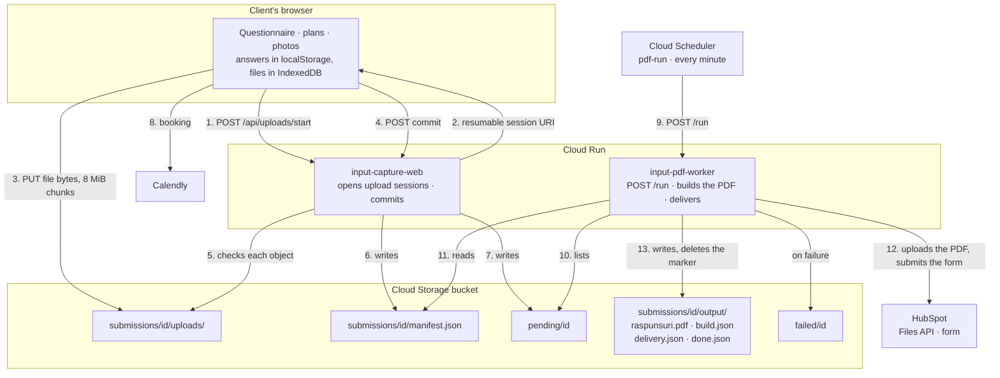

# Architecture: overview

What the system is, what it is made of, where each part runs and how the parts stay in agreement.
The rest of the architecture: `flow.md` (a submission step by step), `storage.md` (what is stored
where), `security.md`. Decisions and their reasons: `adr/`.

---

## What it does

A client fills in a questionnaire about their home, uploads or draws floor plans and adds photos.
Everything lands in one Cloud Storage bucket. A worker turns each submission into a single PDF for
the architect and delivers it to HubSpot.

**There is no database.** The bucket holds the state: which objects exist for a submission says
where it stands. Nothing needs a migration, and a submission can be inspected with `gcloud storage`.

## The code

| Part | What it is |
|---|---|
| `apps/input-capture-web` | The questionnaire: SvelteKit 2, Svelte 5 runes, TypeScript. Everything the client sees is Romanian. Runs as a Node server (`@sveltejs/adapter-node`). |
| `apps/input-pdf-worker` | Builds the PDF from a committed submission and delivers it to HubSpot. A small `node:http` server plus a pure generator on `pdf-lib`. |
| `packages/domain-data` | The shared truth both apps import: the question catalog, the answers schema derived from it, the manifest schema, the upload limits, and fixture submissions. |
| `packages/bucket` | The Cloud Storage client over plain `fetch`, used by both apps, working against Google and the local emulator alike. All bucket access goes through it (ADR 0002). |

## Where it runs

| Service | Role |
|---|---|
| **Cloud Run** `input-capture-web` | The public questionnaire. Scales from zero, capped at 3 instances. Runs as `web-sa`. |
| **Cloud Run** `input-pdf-worker` | Private (no public access), one instance, one request at a time. Runs as `pdf-worker-sa`. |
| **Cloud Storage** (one bucket) | Uploads, manifests, markers and the finished PDFs. Private, uniform access, public access prevented. |
| **Cloud Scheduler** `pdf-run` | Calls the worker's `POST /run` every minute with an OIDC token. |
| **Artifact Registry** | The container images, with a cleanup policy. |
| **Cloud Logging** | One JSON line per event. |
| **Secret Manager** | The HubSpot token, mounted into the worker as `HUBSPOT_TOKEN`. The only secret in the system. |
| **Calendly** (external) | The booking step after sending. |
| **HubSpot** (external) | Where the client and the PDF end up: a contact and a form submission. |

## The picture

File bytes never pass through Cloud Run: the browser sends them straight to the bucket, and the
worker reads them straight from it. Both apps only handle small JSON requests.

## How the two apps stay in agreement

Everything they must agree on lives only in `packages/domain-data` (ADR 0001):

1. **One copy.** The catalog, the answers and manifest schemas, the limits, the fixtures. Both apps
   import its TypeScript directly, so there is no published version to drift.
2. **Compile time.** `npm run check` type-checks all packages together: renaming a question,
   removing an option or changing an answer shape breaks whichever app still uses the old one.
3. **Runtime, at both ends.** The web app validates the manifest before writing it; the worker
   validates it again when reading and refuses a schema version it does not know
   (`manifest_unsupported`).
4. **Shared fixtures are the contract.** `packages/domain-data/fixtures/submissions/{minimal,full}`
   are validated by domain-data's tests and rendered by the worker's tests. `full` answers every
   question the catalog can ask, so a new question without a fixture answer fails the tests.
5. **Versions and deploy order.** Old manifests stay in the bucket. Additive changes keep
   `schemaVersion`; a breaking change bumps it, the worker supports every version it has seen, and
   **the worker deploys first** so it can read what the new web app writes. The rules:
   `packages/domain-data/README.md`.
