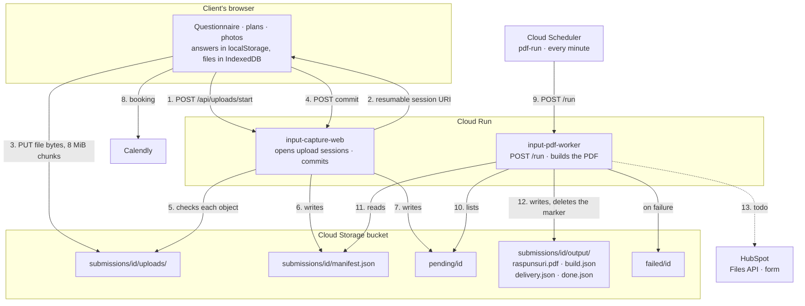

# Architecture — from questionnaire to PDF

What this system is and how a submission travels through it. It describes the whole design,
including the parts not built yet; the table at the end says which is which. Status: 2026-09-16.

Deploying is `docs/deployment.md` (every release), `docs/deploy-web-gcp.md` and
`docs/deploy-worker-gcp.md` (one-time setup).

---

## 1. Overview

A client fills in a questionnaire about their home, uploads or draws floor plans and adds photos.
Everything lands in one Cloud Storage bucket. A worker turns each submission into a single PDF for
the architect and delivers it to HubSpot.

**There is no database.** The bucket holds the state: which objects exist for a submission says
where it stands. Nothing needs a migration, and a submission can be inspected with `gcloud storage`.

### The code

| Part | What it is |
|---|---|
| `apps/input-capture-web` | The questionnaire: SvelteKit 2, Svelte 5 runes, TypeScript. Everything the client sees is Romanian. Runs as a Node server (`@sveltejs/adapter-node`). |
| `apps/input-pdf-worker` | Builds the PDF from a committed submission and (later) delivers it. A small `node:http` server plus a pure generator on `pdf-lib`. |
| `packages/domain-data` | The shared truth both apps import: the question catalog, the answers schema derived from it, the manifest schema, the upload limits, and fixture submissions. |
| `packages/bucket` | The Cloud Storage client over plain `fetch`, used by both apps, working against Google and the local emulator alike. |

### Where it runs

| Service | Role |
|---|---|
| **Cloud Run** `input-capture-web` | The public questionnaire. Scales from zero, capped at 3 instances. Runs as `web-sa`. |
| **Cloud Run** `input-pdf-worker` | Private (no public access), one instance, one request at a time. Runs as `pdf-worker-sa`. |
| **Cloud Storage** (one bucket) | Uploads, manifests, markers and the finished PDFs. Private, uniform access, public access prevented, 45-day lifecycle. |
| **Cloud Scheduler** `pdf-run` | Calls the worker's `POST /run` every minute with an OIDC token. |
| **Artifact Registry** | The container images, with a cleanup policy. |
| **Cloud Logging / Monitoring** | One JSON line per event; alerts on failures and on the site being down. |
| **Cloud Billing budget** | Email at spend thresholds. |
| **Secret Manager** | The HubSpot token, mounted into the worker as `HUBSPOT_TOKEN`. The only secret in the system. |
| **Calendly** (external) | The booking step after sending. |
| **HubSpot** (external) | Where the client and the PDF end up: a contact and a form submission. |

### The picture



File bytes never pass through Cloud Run: the browser sends them straight to the bucket, and the
worker reads them straight from it. Both apps only handle small JSON requests.

---

## 2. The flow, step by step

### 1. The client answers the questionnaire

`/` renders one screen at a time, driven by the catalog in `packages/domain-data`. The URL carries
the screen (`/?s=k3`); plain `/` resumes where the client left off. Chapters, in order: **Despre
tine** (name and email, which rooms), **Planuri** (the plans step), **Locuința** (stage of the
project, household), then one chapter per room picked (kitchen, living room, bedroom, office,
bathroom, hall, other).

Answers live in the browser only: `localStorage["um.answers"]`, the resume position in
`um.cursor`. Nothing reaches the server until the client sends. Screen kinds include single and
multiple choice, text, compound cards and furniture lists; "Altceva" options open a text box.
`/cuprins` shows the chapters up front.

### 2. Picking rooms decides the rest

`c_rooms` drives which chapters exist, how many plan files are allowed (2 per room, never fewer
than 2) and which "furniture kept" screens appear. Unpicking a room removes its chapter and its
answers stop being asked.

### 3. The plans step (`/planuri`), which forks

First a gate: a disclaimer about measuring, with a checkbox ("Am măsurat spațiul"). Until it is
ticked, nothing on the step can be used.

Then, depending on the number of rooms:
- **One room:** the client may **upload** files *or* **draw** the plan. A tile opens the editor.
- **Two or more rooms:** upload only.

Accepted: PDF, JPG, PNG. Images up to 10 MB, PDFs up to 25 MB, and 400 MB for the whole
submission; the same limits in the browser, at the commit and in the schema. Rejections (wrong
type, too big, over the limit, duplicate) are
listed in Romanian, never silent. Files are kept in IndexedDB with their metadata in
`localStorage["um.plans"]`.

The step also takes **photos of the space**, and each room's furniture screen takes **photos of the
furniture being kept** (up to 10 per group, in `um.photos` plus IndexedDB). A furniture photo
carries the room whose screen it was added on; that is what places it in the right chapter of the
PDF. Plans carry no room.

To continue, the client needs the measuring tick and at least one plan file or a drawing.

### 4. Drawing a plan (`/deseneaza`)

A full-screen editor: the client draws the outline, sets wall lengths, ceiling height, doors and
windows. "Gata" saves the model (for later editing), a **room snapshot** (the structured
dimensions), an **SVG** and a **PNG** into `um.plans`, then returns to the plans step.

### 5. The summary (`/rezumat`)

"Ce am înțeles": every question with its answer, by chapter, each with a link back to its screen,
plus the files and photos. Then the send panel with a consent checkbox, which blocks sending until
it is ticked.

### 6. Sending: the files go straight to the bucket

Pressing **Trimit răspunsurile** starts one job per plan file, per photo and for the drawing's PNG,
three at a time:

1. **A submission id** is created once (a UUID in `sessionStorage["um.submissionId"]`), so a retry
   writes into the same folder.
2. **`POST /api/uploads/start`** with `{submissionId, fileId, kind, name, type, size}`. The server
   checks the type and size against the shared limits, decides the object name
   (`uploads/<fileId>.<jpg|png|pdf>`, the drawing always `uploads/drawing.png`) and opens a
   **resumable upload session** on the bucket, returning its URI.
3. **The browser PUTs the bytes** to that URI in 8 MiB chunks. After a network error it asks the
   session how much arrived and continues from there; five attempts with backoff, and an expired
   session is reopened once. Each finished file is remembered in `sessionStorage["um.uploads"]`, so
   a retry skips it. The panel shows a percentage per file.
4. Furniture photos of a room that is no longer picked are left out of the send.

### 7. The commit: the server writes the manifest

`POST /api/submissions/<id>/commit` carries the answers, the drawing (room snapshot and SVG) and
the file list. The server:

1. **Checks every declared object**: it exists, its size matches, and its first 16 bytes really are
   a JPEG, PNG or PDF. A missing or mismatched file comes back as `missing` with its id, and the
   browser uploads just that one again.
2. **Builds `manifest.json`** and validates it against the shared schema.
3. **Writes it once** (create-only; a repeat commit answers `ok` without overwriting).
4. **Writes the empty object `pending/<id>`**, which is how the worker finds new work. A repeat
   commit puts the marker back.

### 8. After sending

With a Calendly link configured, the client goes to `/programare`, books a slot with name and email
prefilled, then `/multumim`. Without a link, straight to `/multumim`. The thanks page clears the
answers, the files and the session keys, so the next project starts clean.

### 9. The worker is triggered

Cloud Scheduler calls `POST /run` every minute with an OIDC token; the service is private, so
nothing else can. A call that arrives while a run is still going gets **429**: the service allows
one instance and one request at a time, and Scheduler simply tries again a minute later. No queue,
no locks. `GET /health` is the health endpoint (Cloud Run intercepts `/healthz`).

### 10. A run

```
list pending/, oldest marker first, PDF_CONCURRENCY submissions at a time (default 2)
for each id:
  output/done.json exists   → delete the marker, next          (job_skipped_done)
  marker older than 15 min  → submission_waiting (ERROR), carry on
  build the PDF from submissions/<id>/                          (pdf_generated; pdf_degraded on warnings)
    → output/raspunsuri.pdf, output/build.json
  deliver                                                       (delivery_skipped today)
    → output/delivery.json
  → output/done.json, delete pending/<id> and any failed/<id>   (submission_delivered)
  on failure → failed/<id> {stage, code, message, detail, at, version}; delete the marker
                                                                (pdf_failed / delivery_failed, ERROR)
no submission is started after RUN_BUDGET_SECONDS (20 min); the next run continues
answer 200 {processed, failed, skipped, left, durationMs}       (run_summary, when anything was pending)
```

Bucket calls that fail on the network, a timeout, 429 or 5xx are retried three times (0.5 s, 2 s).
If the process dies mid-run, the markers stay and the next run starts those submissions again.

### 11. Building the PDF

From the manifest and the uploaded files, in one A4 document:

1. **Cover** — client, date, rooms, counts, submission id.
2. **Contents** — the sections and every client document with its page numbers.
3. **Answers** — every question the client could see, by chapter, with the catalog's labels.
4. **The drawn plan** — the image, ceiling height, walls, doors and windows.
5. **Uploaded plans** — a client PDF gets a separator page, then its pages copied unchanged, each
   stamped along its visual bottom edge ("Document încărcat de client · file · pagina x din n");
   an image plan gets its own stamped page.
6. **Photos** — of the space, then the furniture kept per room, two per row, EXIF rotation applied.

Fonts (Figtree, Newsreader) are embedded and subset, because the standard PDF fonts cannot encode
ă, ș, ț. A client file that cannot be read does not fail the submission: the separator page says why
and the original is attached inside the PDF (`pdf_degraded`).

### 12. Delivery to HubSpot

Three calls, in order, with the token from Secret Manager:

1. **Upload the PDF** to the Files API as `intake-<submissionId>.pdf`, into one File Manager folder,
   with access `PUBLIC_NOT_INDEXABLE`.
2. **Read that URL back with no credentials**, and stop unless the status and the size match: the
   form fetches the file this way and stores whatever comes back without checking it.
3. **Submit the form** `app_input_client` (authenticated submission) with the client's email, first
   and last name, and the file's URL in the field `app_input_capture`. HubSpot creates the contact
   when the email is new, copies the file into its own private storage under
   `/form-uploads/<formId>/`, and points the contact at that copy through a signed redirect. The
   uploaded source stays in the folder.

`delivery.json` records the file id, name, URL, form and email. A 429 or 5xx is tried three times;
anything else fails the submission with the step that failed (`upload_failed`, `file_not_readable`,
`submit_failed`).

With `HUBSPOT_TOKEN` unset, delivery writes `{"hubspot": null}` and logs `delivery_skipped`.

### 13. When something fails

| Where | What happens |
|---|---|
| A chunk upload fails | The browser resumes, then marks the row failed with a retry button. |
| A file is missing at commit | 400/409 naming it; the browser re-uploads only that file. |
| The manifest is refused by its own schema | `commit_rejected` with the schema issues; this is a bug, not client error. |
| A build fails | `failed/<id>` with the stage and code; the marker is removed so runs move on. |
| The worker crashes or is killed mid-run | The marker stays; the next run retries the submission. |
| A submission crashes every run | Its marker never leaves `pending/`; after 15 minutes each run logs `submission_waiting`, which alerts. |
| HubSpot is down or rate-limits | Three attempts; then the PDF stays in the bucket, the submission moves to `failed/` with the step that failed, and `pdf:reprocess` re-runs it. |
| The uploaded file cannot be read back | Delivery stops before the form, so HubSpot never copies an error page as the client's PDF. `failed/<id>` says `file_not_readable`. |

Re-running: `npm run pdf:reprocess -- <id>` moves `failed/<id>` back to `pending/`; `--force` also
deletes `output/`, so a finished submission is built again.

### 14. Retention

A lifecycle rule deletes everything under `submissions/` and `failed/` after **45 days**; soft
delete is off, so nothing lingers invisibly. `pending/` is never touched by the rule: a marker left
behind means something is wrong, and the alert says so.

---

## 3. What is stored where

### The bucket

```
pending/<id>                          empty; written at commit, deleted when the submission is done
failed/<id>                           JSON: stage, code, message, detail, at, version
submissions/<id>/
  uploads/<fileId>.{jpg|png|pdf}      the client's files, named by the server
  uploads/drawing.png                 the drawn plan, when there is one
  manifest.json                       written once at commit
  output/raspunsuri.pdf               the deliverable
  output/build.json                   pages, sections, client documents, warnings, timings, version
  output/delivery.json                what delivery did: the HubSpot file id, url, form and email
  output/done.json                    written last: finished
```

Where a submission stands is read from the objects: `uploads/` only means still uploading or
abandoned; `manifest.json` plus `pending/<id>` means waiting for the worker; `output/done.json`
means finished; `failed/<id>` means the worker gave up. `npm run bucket:ls` prints exactly that.

### `manifest.json`

One self-contained record: `schemaVersion`, `submissionId`, `committedAt`, `appVersion`, `pageUri`,
`locale`, `client` (name, email), `rooms`, the whole `answers` record verbatim, `drawing` (room
snapshot, SVG, the PNG's object name) and `files[]`. Each file carries `fileId`, `kind`
(plan/photo), `group` (space/furniture, photos only), `roomId` (furniture photos only),
`originalName` (sanitised), `contentType` (as sniffed by the server), `size`, `crc32c`, its object
name and `addedAt`. The worker needs nothing else to build the PDF.

### The browser

`um.answers`, `um.cursor`, `um.plans`, `um.photos` in `localStorage`, file blobs in IndexedDB, and
during a send `um.submissionId` and `um.uploads` in `sessionStorage`.

---

## 4. How the two apps stay in agreement

Everything they must agree on lives only in `packages/domain-data`: the catalog, the answers and
manifest schemas, the limits, the fixtures. Both apps import its TypeScript directly, so there is no
published version to drift. `npm run check` type-checks all of it together. The web app validates
the manifest before writing it; the worker validates it again when reading and refuses a schema
version it does not know. Additive changes keep `schemaVersion`; a breaking change bumps it, and
**the worker deploys first** so it can read what the new web app writes.

---

## 5. Observability

Every log line is one JSON object on stdout, which Cloud Logging turns into fields
(`severity`, `event`, `submissionId`, …). Session URIs and file contents are never logged.

| Event | Severity | Where | Means |
|---|---|---|---|
| `upload_session_created` | INFO | web | a resumable session was opened for one file |
| `upload_start_rejected` | WARNING | web | the file was refused (type, size, reserved id) |
| `upload_start_failed` | ERROR | web | the bucket would not open a session |
| `storage_not_configured` | ERROR | web | `GCS_BUCKET` is not set: sending is off |
| `commit_rejected` | WARNING | web | files missing, content mismatched, or the manifest failed its schema |
| `submission_committed` / `submission_already_committed` | NOTICE | web | the manifest was written / was already there |
| `commit_failed` | ERROR | web | the bucket failed during the commit |
| `worker_started` / `worker_stopping` | INFO | worker | the process started / got SIGTERM |
| `run_summary` | INFO | worker | processed, failed, skipped, left, duration — only when something was pending |
| `run_failed` | ERROR | worker | the run could not even list `pending/` |
| `marker_ignored` | WARNING | worker | an object in `pending/` whose name is not a submission id |
| `job_started` / `job_skipped_done` | INFO | worker | a submission was picked up / was already finished |
| `submission_waiting` | ERROR | worker | a marker older than 15 minutes |
| `pdf_generated` | NOTICE | worker | pages, bytes, photos, client documents, duration |
| `pdf_degraded` | WARNING | worker | the PDF was built, but a client file could not be read |
| `pdf_failed` / `delivery_failed` | ERROR | worker | the submission moved to `failed/` |
| `delivery_skipped` | INFO | worker | delivery is not built yet |
| `submission_delivered` | NOTICE | worker | finished; duration and time since the commit |
| `failed_marker_not_written` | ERROR | worker | even the failure could not be recorded; the marker stays |

Alert policies: web submission errors, web site down (an uptime check on `/api/health`), worker
failures (including out of memory), and the Scheduler's calls failing. All of them email the
address set up with the budget.

---

## 6. Security and data protection

- **The bucket is private**: uniform access, public access prevention, no object ever readable
  without credentials. Each app's service account has `roles/storage.objectUser` on this bucket
  only, and gets short-lived tokens from the metadata server. No key files anywhere.
- **The browser never holds a bucket credential**: it gets one resumable session URI per file,
  which is good for that object alone.
- **The worker is private**: only Cloud Scheduler's identity may call it.
- **Client data leaves the EU only for HubSpot**, and the bucket is in `europe-west1`.
- **The delivered PDF is reachable by URL**: the upload is `PUBLIC_NOT_INDEXABLE`, unguessable and
  carrying no client name. HubSpot's copy, which the contact links to, is private.
- **Retention:** 45 days, then everything about a submission is deleted.
- **Known gap:** submission ids are random UUIDs, but nothing binds an id to the browser that
  created it, so someone who learns an id could write into that prefix. The fix is a signed
  submission token issued at the first upload; see the table.

---

## 7. Running it

**Locally:** `npm run deps:up` starts a Cloud Storage emulator in Docker; `npm run dev` serves the
questionnaire, `npm run worker:dev` runs the worker on :3001 with a one-minute tick, and
`npm run pdf:tick` forces a run. `npm run bucket:ls | bucket:files | bucket:pull` look into the
bucket. `npm run pdf:demo` builds PDFs from the fixture submissions without any services.

**In the cloud:** `npm run deploy:web` and `npm run deploy:worker` build an image, push it and
create a Cloud Run revision with every setting from `infra/deploy/*.env`. See `docs/deployment.md`.

---

## 8. Features, and whether they are built

| Feature | Where | Status |
|---|---|---|
| Questionnaire: catalog-driven screens, resume, summary with edit links | web | **Built** |
| Room-driven chapters and per-room questions | web + domain-data | **Built** |
| Plans step: measuring gate, upload or draw, limits and rejections | web | **Built** |
| Floor plan editor: outline, walls, openings, SVG + PNG export | web | **Built** |
| Photos of the space and of furniture kept per room | web | **Built** |
| Consent checkbox before sending | web | **Built** |
| Consent text recorded with the submission | web | **Todo** |
| Direct-to-bucket resumable uploads, chunked, resumable after errors | web + bucket | **Built** |
| Commit: object checks, content sniffing, manifest, pending marker | web | **Built** |
| Calendly booking step, then the thanks page | web | **Built** |
| Signed submission token binding an id to its browser | web | **Todo** |
| Browser-side upload failures reported to the server (`/api/log`) | web | **Todo** |
| Scheduler → `POST /run` every minute, one run at a time | worker + GCP | **Built** |
| Run: ordering, 2 at a time, time budget, skip finished, failure markers | worker | **Built** |
| Retries on transient bucket errors | worker | **Built** |
| PDF: cover, contents, answers, drawn plan, client plans stamped, photos | worker | **Built** |
| Degrading instead of failing on an unreadable client file | worker | **Built** |
| `pdf:reprocess` to re-run one submission | worker | **Built** |
| `qpdf` for very large client PDFs, `sharp` for photo normalisation | worker | **Todo** |
| HubSpot: upload the PDF, submit the form, create/update the contact | worker | **Built** |
| HubSpot token in Secret Manager | GCP | **Todo** |
| Cloud Run deployment of both apps, scripted and repeatable | infra | **Built** |
| Bucket lifecycle (45 days), CORS, private access | infra | **Built** |
| Structured logs and alert policies for both apps | infra | **Built** |
| Budget with email thresholds | infra | **Built** |
| Custom domain instead of the `run.app` URL | infra | **Todo** |
| CI running checks and tests on every push | infra | **Todo** |
| Staging project | infra | **Todo** |
