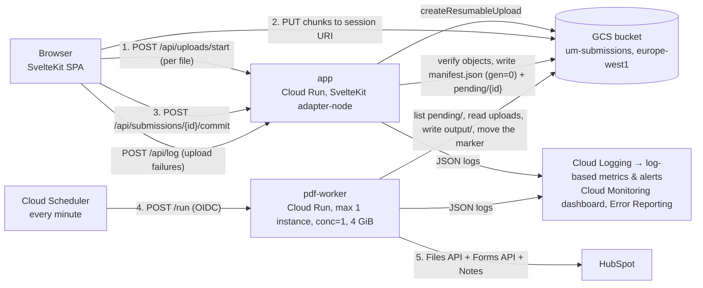

# Submission → PDF pipeline — design

Status: proposal, 2026-09-14; revised the same day: the PDF worker is called by Cloud Scheduler
every minute and finds work through `pending/` markers (§7), instead of a Cloud Tasks queue plus a
sweep. Audience: the owner and the developer who implements it.
Everything marked **[unverified]** was not confirmed on an official page; everything else cites a
source in §18.

---

## 1. Summary

1. The browser no longer pushes files through our server. It asks the app server for an upload
   session per file, uploads each file **directly to a private Google Cloud Storage (GCS) bucket**
   with resumable, chunked PUTs (retries and resume for free), and shows per-file progress.
2. When every file is up, the browser calls **`POST /api/submissions/{id}/commit`** with the
   manifest (answers, drawing, list of files). The server verifies every declared object exists
   with the declared size and real magic bytes, writes `manifest.json` as the atomic commit
   marker (create-only precondition), leaves an empty **`pending/{id}`** object for the worker, and answers "sent". The user goes straight to Calendly / "Mulțumim"; they never wait for
   the PDF.
3. A separate **Cloud Run service `pdf-worker`** (Node 24, at most one instance, one request at a
   time, 4 GiB) is called by **Cloud Scheduler every minute**. Each call lists `pending/` and, for
   each submission, builds **one PDF**: cover, contents, all Q&A from `answerSections`, the drawn
   plan, the uploaded plans, the photos — with every client-uploaded PDF page stamped
   *"Document încărcat de client"* — and writes it to `submissions/{id}/output/raspunsuri.pdf`.
4. The worker uploads that PDF to **HubSpot** (Files API, `PRIVATE`), submits the form (the
   existing `um_*` fields plus the PDF's file id) and attaches the PDF to the contact as a Note.
   Only then is the submission done: the worker writes `output/done.json` and deletes the marker;
   on failure it moves the marker to `failed/{id}`.
5. Every step emits one structured JSON log line; **Cloud Logging log-based alerts** email/Slack
   the studio on any `pdf_failed`, `hubspot_failed`, a submission waiting more than 15 minutes, or
   the worker not having run for 10 minutes. Failed submissions are re-run by hand (`pdf:reprocess`).
6. Key decisions: GCS over R2; server-initiated resumable uploads; commit = verified manifest,
   not "json present"; a once-a-minute scheduled call to a single-instance worker instead of a queue; `pdf-lib` for authored pages
   and `qpdf` for merging/stamping large client PDFs; images normalised with `sharp`
   (EXIF orientation fixed, downscaled to 2200 px); HubSpot files private, not public.

---

## 2. Goals and non-goals

### Goals

- One PDF per submission, delivered into HubSpot; the studio is told immediately if it cannot be.
- "It just works" on a phone: generous limits, no long spinner, resumable uploads, no heavy CPU
  work in the browser.
- Everything after the upload is server-side, logged, retried, alertable — using the hosting
  platform's own tooling, nothing self-operated.
- EU data residency, private storage, minimal retention.
- Local development without a cloud account; a `npm run pdf:demo` that produces a PDF from
  fixtures on disk.

### Non-goals

- Editing or annotating the PDF in HubSpot; OCR; DWG/DXF conversion (dropped formats).
- A studio-facing admin UI. Recovery is a CLI/gcloud path (§10).
- Multi-tenant/multi-brand support.

### Limits (enforced in the browser *and* on the server at commit)

| Limit | Value | Why |
|---|---|---|
| Accepted types | `image/jpeg`, `image/png`, `application/pdf` — by magic bytes on the server, by mime/extension in the browser | All three embed natively in a PDF. HEIC/WEBP/DWG/DXF dropped (need conversion). |
| Per image | 10 MB | Covers 12–24 MP phone photos. Downscaled server-side anyway. |
| Per PDF | 100 MB | Scanned floor plans / cadastral PDFs. Cloudflare's proxy would cap us at 100 MB anyway if files went through it; they do not (§15). |
| Plans (files) | `max(2, rooms × 2)` as today (`maxFiles`) | Unchanged. |
| Photos | 10 per group as today (`MAX_PHOTOS`): space + one furniture group per room | Unchanged. Worst case 7 rooms → 80 photos. |
| Per submission total | 400 MB, 100 objects | Bounds worker memory/time and abuse. |
| Manifest | 8 MB (`BODY_SIZE_LIMIT=8M` on the app server) | Answers + SVG + drawing model are ≪ 1 MB; adapter-node's default is 512 KiB [S-adapter-node]. |
| Upload session TTL | 24 h (server-side record); GCS sessions live one week [S-gcs-resumable] | A user can pause on the summary page and come back. |
| Worker per run | 30 min (Cloud Run request timeout; Cloud Scheduler's longest attempt deadline) [S-run-timeout]; a run stops taking new submissions after 20 min; expected < 60 s per submission | |

---

## 3. Architecture



| Component | What | Where |
|---|---|---|
| `app` | Today's SvelteKit app, adapter switched to `adapter-node`, Docker image | Cloud Run service, `europe-west1`, request-based billing, 512 MiB, concurrency 80 |
| `um-submissions` | Private bucket, uniform bucket-level access, public access prevention, lifecycle 45 days | GCS, `europe-west1` |
| `pdf-worker` | Node 24 service: `POST /run` (work through `pending/`, then answer), `GET /healthz` | Cloud Run service, concurrency 1, 2 vCPU / 4 GiB, timeout 1800 s, min 0, **max 1** |
| Scheduler `pdf-run` | `* * * * *` → `POST /run`, no retries | Cloud Scheduler |
| Logging/Monitoring | log-based metrics, alert policies, dashboard, Error Reporting | Cloud Observability |

Region: **`europe-west1` (Belgium)** for everything. Tier 1 pricing for Cloud Run
[S-run-locations]; same-region bucket ↔ worker traffic. `europe-central2` (Warsaw) is closer to
Romania but Tier 2; the 15–20 ms difference is irrelevant for uploads. Both are EU.

Why one bucket and two services, not one service: the worker needs a different image (qpdf,
sharp, fonts), 8× the memory, concurrency 1 and a 30-minute timeout; the app needs none of that.
Same repo, two Dockerfiles (§14).

---

## 4. Storage layout and data contracts

### 4.1 Bucket choice: GCS vs Cloudflare R2

| | GCS (`europe-west1`) | Cloudflare R2 (`jurisdiction: eu`) |
|---|---|---|
| Egress to worker | Free within the same region (Google-internal path) **[unverified price page]**; low latency | Egress free [S-r2-pricing], but every byte crosses the public internet from Cloudflare to GCP; 100 MB × N per job |
| Direct browser upload | Resumable sessions (server-initiated), 256 KiB chunks, one-week sessions, status query [S-gcs-resumable] | S3 presigned PUT (max 7 days; Content-Type can be signed) [S-r2-presigned]; multipart resumable via S3 API, more client code |
| Create-only / optimistic concurrency | `ifGenerationMatch=0` → 412 if exists [S-gcs-precond] | S3 conditional headers on R2 **[unverified]** |
| Event notifications | Pub/Sub / Eventarc with prefix filter [S-gcs-notify] | Only to Cloudflare Queues; consumable by HTTP pull from outside [S-r2-events] — another hop and credential |
| IAM | Same project, service accounts, no long-lived keys | S3 access keys to manage and rotate |
| Data residency | Single region, EU | `jurisdiction: eu` guaranteed at creation [S-r2-location] |
| Cost at ~5 GB stored | Cents | Cents (10 GB free) |

**Recommendation: GCS.** The worker, scheduler, logs and bucket live in one project with one IAM
model, and the only thing R2 wins on (egress) is worth $0 at this scale. The bucket is exposed to
the code only through a `Storage` adapter (§14), so R2 remains a swap, not a rewrite.

### 4.2 Object layout (one bucket `um-submissions`)

```
pending/{submissionId}               # empty; written by the app at commit, deleted by the worker when done
failed/{submissionId}                # small JSON {stage, code, message, at}; the worker moves the marker here
submissions/{submissionId}/
  uploads/{fileId}.{jpg|png|pdf}     # client files, object name fixed by the server
  uploads/drawing.png                # the drawn plan raster (from Drawing.pngDataUrl)
  manifest.json                      # the commit marker; written once (ifGenerationMatch=0)
  output/raspunsuri.pdf              # the deliverable
  output/build.json                  # page map, sizes, timings, tool versions (debug aid)
  output/delivery.json               # HubSpot ids, one per step, written as each step succeeds
  output/done.json                   # written last: the submission is finished
```

- `submissionId` is the browser-generated UUID kept in `sessionStorage["um.submissionId"]`
  today; it stays the dedupe key end to end (`um_submission_id` in HubSpot). It is bound to an
  HMAC "submission token" issued by the server on first use (§12) so nobody can write into
  another id's prefix.
- `fileId` is the `PlanFileMeta.id` / `PhotoMeta.id` UUID from the stores; the extension comes
  from the sniffed type, never from the client's name.
- Everything under `submissions/` and `failed/` is deleted by lifecycle rules at **45 days** (§12).
  A healthy worker never leaves a `pending/` marker behind; an old one is an alert (§11).

### 4.3 `manifest.json` (schema v1)

```jsonc
{
  "schemaVersion": 1,
  "submissionId": "9c4d…",                  // uuid
  "committedAt": "2026-09-14T10:22:31Z",    // set by the server
  "appVersion": "git:daf8ee8",              // set by the server
  "pageUri": "https://…/rezumat",
  "locale": "ro",
  "client": { "name": "Ana Pop", "email": "ana@example.com" },
  "rooms": ["bucatarie", "living"],         // answers.c_rooms
  "answers": { … },                         // the whole Answers record, verbatim
  "drawing": null | {
    "room": { …RoomSnapshot… },             // types.ts
    "svg": "<svg …>",                       // for future vector rendering
    "pngObject": "uploads/drawing.png",
    "updatedAt": 1757845000000
  },
  "files": [
    {
      "fileId": "b1e2…",
      "kind": "plan" | "photo",
      "group": null | "spatiu" | "mobilier",   // photos only (PhotoMeta.group)
      "roomId": null | "bucatarie",            // furniture photos only; null for plans and space photos
      "originalName": "plan-bucatarie.pdf",    // sanitised with safeFileName()
      "contentType": "application/pdf",        // as SNIFFED by the server at commit
      "size": 31457280,
      "crc32c": "AAAAAA==",                    // from GCS object metadata at commit
      "object": "uploads/b1e2….pdf",
      "addedAt": 1757844000000
    }
  ]
}
```

The manifest is what the worker renders from; it is complete on its own (no HubSpot state, no
browser state). `answers` is stored verbatim so `answerSections(answers, uploads)` in the worker
produces exactly the "Ce am înțeles" the user approved. `uploads` for that call is rebuilt from
`files` (`PlansState.files`, `PhotoMeta[]`) — the same shapes as in the browser.

### 4.4 Where a submission stands

There is no status file; the objects say it:

| Objects | Meaning |
|---|---|
| `uploads/…` only | uploading, or abandoned (lifecycle removes it) |
| `manifest.json` + `pending/{id}` | committed, waiting for the worker |
| `output/done.json` | finished: PDF built and delivered |
| `failed/{id}` | the worker gave up; the body says at which stage and why; re-run with `pdf:reprocess` (§7.5) |

`output/delivery.json` records each HubSpot step's id as it succeeds (`{fileId, formSubmittedAt,
noteId}`), so a re-run after a failure half-way through delivery does not upload the file or
create the note twice. `schemaVersion` bumps are additive; the worker refuses a manifest with a
major it does not know and logs `manifest_unsupported`.

---

## 5. Upload protocol

### 5.1 Flow (per file, run with 3 in parallel in the browser)

```
browser                              app (/api/uploads/start)                 GCS
  │ POST {submissionId, token?,          │                                       │
  │       fileId, kind, group, roomId,   │                                       │
  │       name, size, declaredType} ───▶ │ validate limits; mint token on first  │
  │                                      │ call; file.createResumableUpload(     │
  │                                      │   { origin, metadata:{contentType},   │
  │                                      │     predefinedAcl none })  ──────────▶│ POST x-goog-resumable:start
  │ ◀── {sessionUri, object, token}      │ ◀─────────────────────── Location ────│
  │ PUT chunk 0‥8MiB-1  Content-Range: bytes 0-8388607/31457280  ─────────────▶│ 308 + Range
  │ … PUT last chunk ─────────────────────────────────────────────────────────▶│ 200/201
```

- **Server-initiated resumable session.** Google's own guidance: signed URLs for resumable
  uploads are unnecessary — "the server can initiate the resumable upload instead. The server
  then sends the session URI to the client" [S-gcs-signed]. The server fixes the object name
  and `contentType` in the session; the client cannot choose the path. The session URI is a
  bearer token ("can be used by anyone to upload data to the target bucket" [S-gcs-resumable]),
  so it is only ever returned to the requester over HTTPS and never logged.
- **Chunks of 8 MiB** (multiple of 256 KiB as required [S-gcs-resumable]); a 100 MB PDF is 12
  PUTs. On any network error the client asks GCS where it is (`PUT` with
  `Content-Range: bytes */SIZE` → `308` + `Range`) and continues from there — the same session
  survives a tab reload because `sessionUri` + `object` are cached in `sessionStorage["um.uploads"]`
  (today's `um.uploaded` cache, with the HubSpot URL replaced by the object name).
- **CORS** on the bucket for the app's origin(s), methods `PUT, POST`, headers `Content-Range,
  Content-Type, x-goog-resumable`, exposed `Range, Location`; the `Origin` header must be sent on
  the initiating request and every PUT [S-gcs-resumable] — the server passes `origin` when it
  creates the session.
- **Size enforcement.** The server passes the declared size as the upload's total length
  (`X-Upload-Content-Length` on the initiating request **[unverified that GCS rejects a
  mismatch]**), and re-checks `size` from object metadata at commit — the authoritative check.
- **Integrity.** GCS validates a supplied `x-goog-hash` against its own computation
  [S-gcs-headers]; computing CRC32C of 100 MB in the browser is optional (Web Crypto has no CRC;
  a small JS implementation runs ~200 MB/s **[unverified]**). Recommendation: **skip client-side
  hashing in M2**; TLS + the resumable protocol's byte offsets already prevent truncation, and
  commit verifies size and magic bytes. Record GCS's `crc32c` in the manifest so the worker can
  verify what it reads. Add client CRC32C later only if corrupt uploads are ever observed.
- **Progress.** `SubmitPanel` keeps its step list (`planSteps`), but each row now shows a
  percentage (bytes sent / size, updated per chunk) instead of `în așteptare / se trimite /
  trimis`. Failures keep today's Romanian messages and the retry button.
- **Duplicates and re-sends.** Same submission id ⇒ same object names ⇒ a re-send overwrites
  the same objects (PUT to a completed session is a no-op; a new session for the same object
  simply replaces it). Two different ids from the same person (closed tab) produce two
  submissions, as today; HubSpot dedupes contacts by email, and both PDFs land on the contact.
  Acceptable; a "resume last submission" cookie is listed as an open question.
- **The drawing.** `Drawing.pngDataUrl` (2× raster, typically 0.3–1 MB) is uploaded as
  `uploads/drawing.png` through the same protocol; `room` and `svg` travel inline in the manifest.
  No separate JSON upload any more.
- **Upload sessions bookkeeping.** The app keeps no database; the only server state is the
  bucket. The token (§12) carries `submissionId` + `iat`; limits per submission are enforced at
  commit (list the prefix, count, sum sizes) and per request (declared size ≤ per-file limit).

### 5.2 What the browser does *not* do any more

No `/api/upload` multipart POST through the server, no per-file HubSpot upload, no JSON drawing
upload, no 25 MB cap. `runSubmission` keeps its injectable shape (`fetchImpl`, `getBlob`,
`storage`, `onProgress`) so `submit.test.ts` still drives it without a browser.

---

## 6. The commit step

### 6.1 Why "manifest present ⇒ all files present" is not enough

The owner's rule works only if the manifest is written *after* the files and *by someone who
checked*. Written by the browser it fails in four ways: a chunked upload that ended in a
`308` (partial) still has an object entry in some listings; a client can write a manifest that
lists files it never sent; a file replaced mid-way (user removes and re-adds a photo with the
same id) can be listed with the old size; and a crashed tab can leave a manifest for a
submission the user then edits and re-sends. So the manifest is written by the **server**, after
verification, and is the *only* thing that means "committed".

### 6.2 `POST /api/submissions/{id}/commit`

1. Authenticate the submission token; reject if `id` mismatches.
2. Validate the body against the manifest schema (`answers` is a record, `files[]` well-formed,
   counts within limits, `client.email` looks like an email). Reuse `validate()` from
   `/api/submit`.
3. `HEAD` each declared object (`file.getMetadata()`): must exist, `size` must equal the
   declared size, sum ≤ 400 MB. Read the first 16 bytes (ranged read) and sniff: `FF D8 FF` →
   JPEG, `89 50 4E 47 0D 0A 1A 0A` → PNG, `%PDF-` → PDF; the sniffed type overrides whatever
   the client said and is what goes into the manifest. Anything else → 400 with the file name
   (`Fișierul „x" nu este PDF, JPG sau PNG.`).
4. Fill in `committedAt`, `appVersion`, `crc32c` per file; write `manifest.json` with
   `ifGenerationMatch: 0`. **412 ⇒ already committed** → idempotent success.
5. Write the empty object `pending/{id}` — on a repeat commit too, so a marker lost after the
   manifest (the write failed, the client retried) is put back. The worker skips a submission that
   already has `output/done.json`, so a stray marker costs one list entry, not a second PDF.
6. Log `submission_committed` and answer `{ok:true, submissionId}`. The app depends on nothing
   but the bucket: no queue, no worker, no HubSpot.

Commit takes a few hundred ms (N metadata reads + N ranged reads in parallel). It runs through
Cloudflare's proxy comfortably (125 s limit [S-cf-524]).

### 6.3 What the user sees

- Progress rows per file, then "Trimit răspunsurile" (the commit). On `ok` the panel navigates
  exactly as today: `/programare` (Calendly) if `PUBLIC_CALENDLY_URL` is set, else `/multumim`.
  "Sent" means *committed*, not *PDF delivered* — the PDF is our problem, not the user's.
- `/multumim` copy stays ("Dacă lipsește ceva vei fi contactat pe mail."). Optional later: a
  confirmation email from HubSpot once the note exists (owner decision, §17).
- Browser storage is cleared after commit as today (`clearSubmissionState`).

---

## 7. Triggering and processing

### 7.1 Options

| | (a) **Cloud Scheduler → single-instance Cloud Run service polling `pending/`** | (b) Commit enqueues a Cloud Tasks task → worker, plus a sweep | (c) Eventarc (GCS finalize of `manifest.json`) → worker |
|---|---|---|---|
| Latency | ≤ 1 min, plus the build | seconds | seconds (triggers take up to 2 min to become active [S-eventarc]) |
| The app depends on | the bucket only | the queue, and IAM to mint OIDC tokens | the bucket only |
| At most one build at a time | `max-instances=1` + `concurrency=1` | queue `max-concurrent-dispatches` | not built in |
| Retries | a failure moves the marker to `failed/`; re-run by hand | queue backoff; a sweep for what the queue dropped; `status.json` claims | Pub/Sub retry policy, dead-letter topic |
| Moving parts | one scheduler job | queue, sweep job, claim protocol | trigger, hidden topic, subscription |
| Cost | ~1,440 list calls and short requests a day: cents (§15) | ~0 | ~0 |

### 7.2 Decision: **(a)**

At one or two submissions a day a minute of latency is invisible (the client is booking a Calendly
slot meanwhile), and (a) removes the queue, the sweep, the claim protocol and the app's dependency
on anything but the bucket.

- **Cloud Scheduler** job `pdf-run`: `* * * * *`, `POST https://pdf-worker…/run` with an OIDC
  token, **no retries**, attempt deadline 30 min.
- **`pdf-worker`** Cloud Run service: `--min-instances=0 --max-instances=1 --concurrency=1`,
  request-based billing. All the work happens inside the `/run` request, so CPU is allocated for it
  [S-run-cpu]; an idle instance between calls is not billed.
- **No overlap.** While a run is still building, the next minute's call finds the only instance
  busy, is held briefly, then refused (429). Scheduler records a failed attempt and calls again a
  minute later. These attempts are expected and not alerted on.
- **The rare exception.** Cloud Run can briefly run more instances than `max-instances` (e.g. while
  a new revision rolls out) **[unverified wording; documented as possible]**. The worst case is one
  submission built twice at the same moment. The `done.json` check and `delivery.json`'s per-step
  ids keep this from delivering twice unless both copies are in the same HubSpot step at once;
  at this volume that is accepted.
- **Locally** there is no `max-instances`: the worker also refuses a `/run` while one is in
  progress (an in-process flag), so a dev tick and a manual call cannot overlap either.

### 7.3 `POST /run`

```
started = now
list pending/                                  (one call, usually empty)
for each id, oldest marker first:
  if now - started > 20 min → stop; the rest waits for the next run
  if submissions/{id}/output/done.json exists  → delete pending/{id}; log job_skipped_done; next
  if the marker is older than 15 min           → log submission_waiting (alert)
  log job_started
  build the PDF from submissions/{id}/         (§8) → write output/raspunsuri.pdf, output/build.json
  deliver                                      (§9; a step whose id is in delivery.json is skipped)
  write output/done.json; delete pending/{id}; log submission_delivered
  on error — after in-run retries of transient bucket/HubSpot errors (3 tries, backoff):
     write failed/{id} {stage: build|deliver, code, message, at}; delete pending/{id}
     log pdf_failed or hubspot_failed (ERROR)
answer 200 {processed, failed, left}; log run_summary only when pending/ was not empty
```

Degraded client files (§8.5) are not failures: the PDF is delivered and `pdf_degraded` is logged.

### 7.4 Settings

| Setting | Value |
|---|---|
| Scheduler `pdf-run` | `* * * * *`, HTTP POST `/run`, OIDC as `pdf-run-invoker@…` (has `roles/run.invoker` on `pdf-worker`), `--max-retry-attempts=0`, `--attempt-deadline=30m` |
| `pdf-worker` | `--concurrency=1 --min-instances=0 --max-instances=1`, `--cpu=2 --memory=4Gi`, `--timeout=1800`, request-based billing, startup CPU boost on, `--no-allow-unauthenticated` |
| Bursts | 10 people sending in the same minute ⇒ one run builds them one after another, < 1 min each ⇒ all done in ~10 min; a run stops taking new ones after 20 min and the next run continues. |

### 7.5 Re-running a submission

`npm run pdf:reprocess -- <submissionId> [--force]` moves `failed/{id}` back to `pending/{id}`
(or just writes the marker); the next run picks it up. Without `--force` the run builds the PDF
again and skips the HubSpot steps already in `delivery.json`; a submission with `done.json` is
skipped. `--force` deletes `output/` first: a full rebuild and a new delivery (a second file and
note in HubSpot). Used after fixing the cause: a config, a generator bug, a HubSpot outage.

---

## 8. PDF generation

### 8.1 Tooling

| Need | Tool | Licence | Why |
|---|---|---|---|
| Authored pages (cover, contents, Q&A, plan page, photo pages, separators), stamp overlays | **`pdf-lib` 1.17.1** or the maintained fork **`@cantoo/pdf-lib` 2.11.0** | MIT [S-npm-pdflib] [S-npm-cantoo] | Proven in our spikes: fonts with diacritics, images, ~50 ms per doc. Fork is a drop-in; adopt it in M1 if its test-suite passes with our fixtures, else stay on 1.17.1 (frozen since 2022 is not a risk for a pure library). |
| Merge, stamp, normalise, compress large client PDFs | **`qpdf`** (CLI, Debian package) | Apache-2.0 [S-qpdf-readme] | `--pages` merges page ranges from many files, `--overlay` puts stamp pages on every page, `--decrypt`, `--flatten-rotation`, `--check`, `--object-streams=generate`, job JSON [S-qpdf-cli]. Runs as a subprocess with files on disk, so Node's heap never holds a 100 MB document. |
| Image decode/orient/resize/re-encode | **`sharp`** | Apache-2.0 **[unverified on this fetch; sharp's package is Apache-2.0]** | `.autoOrient()` — "Auto-orient based on the EXIF Orientation tag, then remove the tag" [S-sharp]; libvips streams. |
| Alternative for stamps/merge | `pdfcpu` (Go CLI) | Apache-2.0 [S-pdfcpu] | Does merge/stamps/validate/decrypt too; one more toolchain (Go binary) for no gain over qpdf. Keep as plan B. |
| Rejected | Ghostscript, MuPDF | AGPL **[unverified on this fetch; widely known]** | Licence; also far heavier than needed. |

Note on qpdf memory: the docs make no statement about streaming; qpdf keeps the object
structure in memory and pipes stream data, so a 100 MB scanned PDF (few objects, huge image
streams) costs far less than 100 MB of heap **[unverified — measure in M1 with the 100 MB
fixture; budget assumes ≤ 1.5× input]**.

### 8.2 Memory and time budget (worst case: 2 × 100 MB client PDFs + 80 photos × 10 MB)

| Phase | Where | Peak RSS estimate |
|---|---|---|
| Download objects to `/tmp` (streamed) | `/tmp` is **in-memory** on Cloud Run and counts against the limit [S-run-memory], so the worker never stages the whole submission: it keeps at most one client PDF and one photo on `/tmp` at a time (photo: stream → sharp → ~400 KB JPEG buffer → original deleted). A GCS FUSE volume would avoid this but adds latency for no gain at these sizes. | ≤ 110 MB `/tmp` + 30 MB buffers |
| Photo normalisation (sequential) | sharp decodes 12–24 MP → ~100–150 MB working set, released per photo | ~200 MB |
| Body document in pdf-lib (cover…photos, separators, stamps) | 80 JPEGs × ~400 KB embedded ≈ 35 MB + objects; pdf-lib `save()` needs input + output ≈ 3× | ~150 MB |
| qpdf per client PDF (`--decrypt --flatten-rotation`, then `--overlay`) | subprocess, ≤ 1.5 × 100 MB **[unverified]** | ~150 MB |
| Final `qpdf --pages` merge + `--object-streams=generate` | subprocess; output ~ sum of inputs | ~250 MB |
| Node baseline | | ~120 MB |

Total worst case ≈ 1 GB with `/tmp` included; **4 GiB** gives 4× headroom and lets us raise
limits later without re-sizing. 2 vCPU because sharp and qpdf are CPU-bound; expected wall time
30–90 s worst case, < 10 s typical (6 photos, one 5 MB PDF). Set `NODE_OPTIONS=--max-old-space-size=2048`.

### 8.3 Fonts

- Embed the site fonts so the PDF looks like the app: **Figtree** (labels, answers) and
  **Newsreader** (questions, headings), via `@pdf-lib/fontkit`, `subset: true`.
- Our spike: the variable TTFs embed with correct diacritics but render only the default
  weight; split `latin-ext` WOFFs render only extended glyphs; the standard 14 fonts cannot
  encode ă/ș/ț. Therefore ship **static instances** in `src/lib/pdf/fonts/`: Figtree Regular +
  SemiBold, Newsreader Light + Regular (Google Fonts publishes static instances for these
  families **[unverified — if absent, generate them once with `fonttools varLib.instancer`,
  SIL OFL allows it]**). Both are SIL OFL 1.1 — embedding in a document is permitted.
- A unit test renders "ăâîșțĂÂÎȘȚ" with each face and asserts no throw + glyph count.

### 8.4 Images

- Every JPEG/PNG: `sharp(input).autoOrient().resize({ width: 2200, height: 2200, fit: 'inside',
  withoutEnlargement: true }).jpeg({ quality: 82, mozjpeg: true })`. This fixes the **EXIF
  orientation** gotcha (PDF viewers ignore EXIF; sharp rotates the pixels and drops the tag),
  bounds size (2200 px ≈ 300–600 KB) and strips metadata (GPS coordinates in phone photos — a
  GDPR plus).
- PNG with alpha or a palette (screenshots of plans): keep PNG (`.png({ palette: true })`) so
  line art stays crisp; same resize.
- The **drawn plan PNG** is already a clean 2× raster (`svgToPngDataUrl(svg, 2)`); embed as is.
- Originals are never embedded, so the output size is predictable: photos ≈ 0.5 MB each,
  plus client PDFs pass-through. Typical output 3–15 MB; worst case ~250 MB (two 100 MB scans)
  — see the HubSpot limit in §9.

### 8.5 Client PDFs: normalise, stamp, ingest

For each `kind: plan` file with `contentType: application/pdf`:

1. `qpdf --check in.pdf` (exit 0/3 fine; 2 ⇒ `pdf_invalid`, permanent) [S-qpdf-cli]. If
   qpdf reports it is encrypted with a user password, try `--password=""`; otherwise
   `pdf_encrypted` (permanent failure → §10).
2. `qpdf --decrypt --flatten-rotation --warning-exit-0 in.pdf norm.pdf` — removes owner-password
   restrictions (we only copy the pages; the client gave us the file) and bakes `/Rotate` into
   the content so a landscape scan rotated by 90° is a *real* landscape page [S-qpdf-cli]. That is
   what makes stamping robust: after this, every page's MediaBox is its visual orientation.
3. `qpdf --json --json-key=pages norm.pdf` → page count and each page's MediaBox/CropBox.
4. Build **`stamps.pdf`** with pdf-lib: one page per client page, sized to that page's
   *CropBox* (falls back to MediaBox), containing a 9 mm strip across the bottom: 70%-white
   rectangle + Figtree 8 pt text `Document încărcat de client · plan-bucatarie.pdf · pagina 2
   din 5` and the same text small and rotated along the left edge (survives cropping of the
   footer when printed). Unusual sizes (A0 scans, tiny receipts) are handled by construction —
   the strip is positioned relative to the CropBox.
5. `qpdf norm.pdf --overlay stamps.pdf -- stamped.pdf` — overlay page *i* onto page *i*
   [S-qpdf-cli]. Because both have identical boxes, no scaling happens. If qpdf overlay
   scaling ever misbehaves on a CropBox≠MediaBox file, fallback: pdf-lib `embedPdf` of each
   normalised page into a fresh page (memory 5× — only for files ≤ 20 MB) **[fallback untested]**.
6. The **separator page** (in the body document, before the imported pages):
   "Document încărcat de client", file name, page count,
   size, and "Paginile următoare sunt reproduse exact așa cum au fost trimise." Set in the body's
   own type so it is obviously *ours*, while the stamped pages are obviously *theirs*.

Images uploaded as plans (JPG/PNG floor plans) are placed one per page in the body document
with the same strip drawn directly by pdf-lib (no qpdf pass needed).

### 8.6 Page layout (A4 portrait, 18 mm margins; the body document)

1. **Cover** — wordmark, "Configurează-ți proiectul", client name, email, date (`ro-RO`),
   rooms (labels), submission id (small, monospace), app version.
2. **Cuprins** — chapters with page numbers; "Planuri încărcate" listing every client document
   (name · room · pages · "pagina N"); "Poze" per group. Page numbers require the client-PDF
   page counts → step 8.5.3 runs *before* the body is built.
3. **Răspunsuri** — one section per `answerSections()` chapter, `01 Despre tine` … exactly as
   `/rezumat` renders: question in Newsreader, answer lines in Figtree, "Fără răspuns" in grey.
   `href` is dropped. Furniture screens list items and "Imagini: n poze" as `answerLines` does.
4. **Planul desenat** (if `drawing`) — the PNG fit to the page, then a dimension table from
   `RoomSnapshot`: ceiling height, outline closed?, per wall: heading, length (with `source`
   typed/drawn/computed), openings (kind, length, sill, hinge/swing). `unanswered` listed.
5. **Planuri încărcate** — separator page per client document (§8.5.6); image plans one per
   page; the actual client PDF pages are spliced in at merge time.
6. **Poze** — "Pozele spațiului", then "Mobilier păstrat · Bucătărie" etc. 2 photos per page
   (portrait) or 1 (landscape), file name as caption, in `addedAt` order.
7. Footer on every body page: `Urban Moon · {client} · pagina x din y` — `y` is the final total,
   known before rendering because all counts are known.

Final assembly: `qpdf --empty --pages body.pdf 1-12 c1-stamped.pdf 1-z body.pdf 13-14
c2-stamped.pdf 1-z body.pdf 15-40 -- final.pdf` then `qpdf --object-streams=generate
--stream-data=compress final.pdf out.pdf` [S-qpdf-cli]. Set the document info (Title, Author
"Urban Moon", Subject = submission id, `/Lang (ro-RO)`), and attach `manifest.json` as an
embedded file (pdf-lib `attach`) so the studio can recover the raw data from the PDF alone.

Output `build.json` records page map, per-phase durations, tool versions, and output size — the
same numbers go in the `pdf_generated` log event.

---

## 9. Delivery to HubSpot

1. **Upload** `raspunsuri.pdf` → `POST /files/v3/files`, `access: "PRIVATE"`, folder
   `/proiecte/{email-slug}/`, name `raspunsuri-{yyyy-mm-dd}-{id8}.pdf`. Store the returned `id`
   in `output/delivery.json` before anything else so a retry never uploads twice. The HubSpot
   file is private; humans open it inside HubSpot, code uses `GET /files/v3/files/{id}/signed-url`
   [S-hs-files].
   - Size limit: the files tool accepts "up to 2 GB for accounts with paid subscriptions … If a
     file is 1 GB or more, you may experience issues" [S-hs-filetypes]; **whether the same limit
     applies to API uploads is not documented [unverified]** — our worst case is ~250 MB, and M4
     tests a 250 MB upload against the real portal.
   - The 15 s `TIMEOUT_MS` in `client.ts` becomes size-aware: 60 s + 10 s/10 MB.
2. **Form submission** — same `POST /submissions/v3/integration/secure/submit/…` as today,
   `buildSubmission()` unchanged except: `um_plan_files` / `um_photo_files` / `um_plan_drawing_png`
   become lines of `originalName | room | group | size` (no URLs — the files are private and
   inside the PDF), and new fields `um_pdf_file_id`, `um_pdf_name`, `um_pdf_pages`,
   `um_pdf_size`, `um_pipeline_version`. `um_readback`, `um_answers_json`, `um_plan_drawing_json`,
   `um_submission_id` stay. The form is submitted **after** the file exists, so the contact record
   is created with the file id on it in one step.
3. **Attach to the contact** — `GET /crm/v3/objects/contacts/{email}?idProperty=email`
   **[unverified on this fetch; documented contacts endpoint]** → `POST /crm/v3/objects/notes`
   with `hs_timestamp`, `hs_note_body` ("Chestionar completat — PDF atașat. Camere: …"),
   `hs_attachment_ids: "<fileId>"`, and `associations` to the contact with `associationTypeId
   202` [S-hs-notes]. Scopes: `files`, `forms`, `crm.objects.contacts.read/write`. Store `noteId`.
   The note is what makes the PDF visible on the timeline — and what a HubSpot workflow can
   notify the studio on.
4. **Retries / idempotency** — each of the three steps is skipped if its id/timestamp is already
   in `output/delivery.json`. `429` → honour `Retry-After` if present, else back off; limits are 100–190
   requests / 10 s per private app [S-hs-limits] — we make three. `5xx`/network → retryable
   failure (retried within the run, then `failed/`); `4xx` other than 429 → permanent `hubspot_rejected` with the
   body logged (truncated).
5. **HubSpot down** — the PDF is already in the bucket; the run retries a few times, then moves
   the marker to `failed/` and `hubspot_failed` alerts. Once HubSpot is back, `pdf:reprocess`
   delivers it (steps already done are skipped). The studio can fetch the PDF from the bucket by
   hand (`gcloud storage cp`) in the meantime.

---

## 10. Failure handling

| Failure | Behaviour | Retry | Alert | Manual path |
|---|---|---|---|---|
| Upload abandoned (user leaves) | Objects sit under `submissions/{id}/uploads/`, no manifest | — | none (normal) | Lifecycle deletes at 45 days. |
| Chunk PUT fails / offline | Client queries `bytes */N`, resumes; 5 attempts with backoff, then row "a eșuat" + retry button | client | `upload_failed` from `/api/log` → metric; alert if > 5 in 1 h | — |
| Commit: object missing / size mismatch | 400 with the file name; client marks the row failed and re-uploads only that file | client | `commit_rejected` counter | — |
| Commit: manifest write 412 | Already committed → `ok` | — | — | — |
| Commit: marker write fails after the manifest | 502 to the browser; the client retries; the repeat commit writes the marker | client | `commit_failed` (ERROR) | — |
| Worker crash / OOM mid-run | The request dies; the marker stays in `pending/`; the next minute's run starts that submission again | next run | memory alert; `submission_waiting` if it keeps crashing | see the poison row |
| Corrupt client PDF (`qpdf --check` exit 2) | Permanent `pdf_invalid`; **degrade, don't fail**: the separator page says "Fișierul nu a putut fi citit; este atașat ca fișier în PDF" and the original bytes are attached as an embedded file; the job continues and the PDF is delivered | — | `pdf_degraded` (WARNING) — the studio is told which file to ask for again | ask the client for a new file |
| Encrypted PDF (needs user password) | Same degrade path: `pdf_encrypted` | — | `pdf_degraded` | same |
| Generator bug (exception) | `pdf_failed` with stack → Error Reporting group; marker → `failed/` | none | **yes, immediately** (ERROR) | fix, deploy, `pdf:reprocess` |
| HubSpot 5xx / timeout | 3 tries within the run, then `failed/` (stage `deliver`); the PDF stays in the bucket | `pdf:reprocess` | `hubspot_failed` (ERROR) | upload by hand from the bucket if urgent |
| HubSpot 4xx (bad token, form guid, property missing) | `hubspot_rejected`, marker → `failed/` | none until config fixed | **yes** (ERROR) | fix config, `pdf:reprocess` |
| Poison submission (crashes the process every time) | Its marker never leaves `pending/`; every run crashes on it and the ones behind it wait | — | `submission_waiting` after 15 min; worker 5xx | move the marker to `failed/` by hand (`gcloud storage mv`), investigate with the logs by `submissionId`. A crash counter on the marker would automate this; not needed at this volume. |
| Bucket/IAM misconfig | Every commit 500s | — | 5xx spike alert | — |

Every failure leaves `failed/{id}` with the stage and the error and, when the build got that far,
`output/build.json`.
Everything in the studio's hands is either HubSpot or a `gcloud storage` command.

---

## 11. Observability

### 11.1 Log line schema (app and worker, one JSON object per line on stdout)

Cloud Run parses JSON on stdout into `jsonPayload`; `severity`, `message`,
`logging.googleapis.com/trace`, `logging.googleapis.com/labels` are lifted into the LogEntry
[S-run-logging]. Container logs correlate with request logs only if we put the trace id from
`X-Cloud-Trace-Context` into `logging.googleapis.com/trace` [S-run-logging] — the app's
`hooks.server.ts` does that per request.

```jsonc
{
  "severity": "INFO",                       // DEBUG INFO NOTICE WARNING ERROR CRITICAL
  "message": "pdf_generated 9c4d… 37 pages 48.2 MB in 6.1 s",
  "event": "pdf_generated",                 // stable snake_case name, see list
  "submissionId": "9c4d…",                  // on every line that has one
  "service": "pdf-worker", "version": "git:daf8ee8",
  "attempt": 1, "durationMs": 6100,
  "sizes": { "inputBytes": 133000000, "outputBytes": 48211043, "pages": 37, "files": 9 },
  "error": { "code": "pdf_encrypted", "message": "…", "stack": "…" },   // on failures
  "logging.googleapis.com/trace": "projects/P/traces/T",
  "logging.googleapis.com/labels": { "submissionId": "9c4d…" }
}
```

A tiny `src/lib/server/log.ts` (`log.info(event, fields)`) is the only way code writes logs;
`console.error` in the current code is replaced. No file names of the client's *contents* beyond
the sanitised original name; never email in `message` (it lives in `jsonPayload.client` only
where needed, and can be redacted with a Cloud Logging exclusion if the owner wants).

### 11.2 Events

| Event | Sev | Where | Key fields |
|---|---|---|---|
| `upload_session_created` | INFO | app | fileId, kind, size, contentType |
| `upload_failed` | WARNING | app (`/api/log` from the browser) | fileId, httpStatus, attempt, userAgent |
| `commit_rejected` | WARNING | app | reason, fileId |
| `submission_committed` | NOTICE | app | files, totalBytes, rooms |
| `commit_failed` | ERROR | app | error (bucket unreachable, marker write failed) |
| `job_started` / `job_skipped_done` | INFO | worker | markerAgeSec |
| `pdf_generated` | NOTICE | worker | durationMs, sizes, phases{download, images, qpdf, body, merge} |
| `pdf_degraded` | WARNING | worker | fileId, code (pdf_invalid/pdf_encrypted) |
| `pdf_failed` | ERROR | worker | code, permanent, stack |
| `hubspot_file_uploaded` / `hubspot_form_submitted` / `hubspot_note_created` | INFO | worker | ids, durationMs |
| `hubspot_failed` | ERROR (5xx) / WARNING (429) | worker | httpStatus, step |
| `hubspot_rejected` | ERROR | worker | httpStatus, body (≤ 1 KB) |
| `submission_delivered` | NOTICE | worker | totalMs since committedAt |
| `submission_waiting` | ERROR | worker | ageMin (a marker older than 15 min when a run reaches it) |
| `run_summary` | INFO | worker | processed, failed, left, durationMs — only when `pending/` was not empty |

### 11.3 Log-based metrics (counters unless noted) [S-log-metrics]

| Metric | Filter |
|---|---|
| `um/submission_committed` | `resource.type="cloud_run_revision" AND jsonPayload.event="submission_committed"` |
| `um/submission_delivered` | `… jsonPayload.event="submission_delivered"` |
| `um/pdf_failed` (label `code` from `jsonPayload.error.code`) | `… jsonPayload.event="pdf_failed"` |
| `um/pdf_degraded` (label `code`) | `… jsonPayload.event="pdf_degraded"` |
| `um/hubspot_failed` (label `step`, `httpStatus`) | `… jsonPayload.event=~"hubspot_(failed\|rejected)"` |
| `um/upload_failed` | `… jsonPayload.event="upload_failed"` |
| `um/pdf_duration_ms` (distribution, field `jsonPayload.durationMs`) | `… jsonPayload.event="pdf_generated"` |
| `um/pdf_output_bytes` (distribution, field `jsonPayload.sizes.outputBytes`) | same |
| `um/waiting` | `… jsonPayload.event="submission_waiting"` |

### 11.4 Alert policies

| Alert | Type | Condition | Channel |
|---|---|---|---|
| Any PDF failure | log-based [S-log-alerts] | `resource.type="cloud_run_revision" AND resource.labels.service_name="pdf-worker" AND jsonPayload.event="pdf_failed"` | email + Slack, immediately; min interval 5 min; autoclose 30 min |
| Any HubSpot failure / config error | log-based | `jsonPayload.event="hubspot_rejected" OR jsonPayload.event="hubspot_failed" OR jsonPayload.event="commit_failed"` | email + Slack |
| Committed but not delivered | log-based | `jsonPayload.event="submission_waiting"` (the worker logs it when it reaches a marker older than 15 min) | email + Slack |
| Degraded PDF (client file unreadable) | log-based | `jsonPayload.event="pdf_degraded"` | email (the studio must ask the client for the file) |
| Upload failures | metric threshold | `logging.googleapis.com/user/um/upload_failed` > 5 in 60 min | email |
| 5xx spike | metric threshold | `run.googleapis.com/request_count` with `response_code_class="5xx"` > 5 in 5 min, either service | email + Slack |
| Worker memory | metric threshold | `run.googleapis.com/container/memory/utilizations` p99 > 85 % for 5 min on `pdf-worker` | email |
| Worker not running | metric absence | no `run.googleapis.com/request_count` with `response_code_class="2xx"` on `pdf-worker` for 10 min: Scheduler paused, IAM broken, or every run crashing (absence conditions exist [S-mon-conditions]) | email + Slack |
| Site down | uptime check on `GET /api/health` every 5 min from 3 EU locations | 2 consecutive failures | email + SMS ("SMS isn't a fully reliable notification channel type" [S-notif] — never the only channel) |
| New error group | Error Reporting auto-notification **[unverified on this fetch]** | any new group in either service | email |

Channels supported: email, SMS, Slack, PagerDuty, Pub/Sub, webhooks, Google Chat, mobile app
[S-notif]. Start with **email + Slack**.

### 11.5 Dashboard ("Chestionar — pipeline", one page)

Row 1 scorecards: committed today · delivered today · failed (24 h) · waiting now (from the
last `run_summary`) · median PDF time · median PDF size. Row 2: line chart committed vs
delivered per hour; stacked bars `pdf_failed` by `code`; `hubspot_failed` by `step`. Row 3:
Cloud Run request count/latency/5xx for both services; worker memory and instance count; Cloud
Scheduler attempts (429s are expected while a long run is busy). Row 4:
logs panel filtered to `severity>=WARNING`. Defined as JSON, created with `gcloud monitoring
dashboards create` and kept in `infra/monitoring/dashboard.json`.

### 11.6 Useful Logs Explorer queries (operators: `=`, `!=`, `:`, `=~`, `>=`; `AND/OR/NOT` [S-log-query])

```
# everything about one submission, both services
resource.type="cloud_run_revision" AND jsonPayload.submissionId="9c4d…"
# failures in the last day
resource.type="cloud_run_revision" AND severity>=ERROR AND resource.labels.service_name=~"^(app|pdf-worker)$"
# slow PDFs
jsonPayload.event="pdf_generated" AND jsonPayload.durationMs>30000
```

Retention: `_Default` bucket, 30 days [S-log-buckets]; free allotment and the per-GiB price
beyond it were not extractable from the (client-rendered) pricing page **[unverified: earlier
scouting says 50 GiB/project/month free]**. At tens of submissions/day we log kilobytes.
Anything needing a longer trail (delivery audit) is in HubSpot and in `delivery.json`/`build.json`
for 45 days.

---

## 12. Security and GDPR

- **Bucket**: uniform bucket-level access, public access prevention enforced, no ACLs, no
  public URLs ever. Encryption at rest with Google-managed keys is the default
  **[unverified on this fetch; standard GCS behaviour]**. One region in the EU.
- **Today's HubSpot uploads are `PUBLIC_NOT_INDEXABLE`** — unauthenticated URLs to clients'
  floor plans and photos of their homes. **Flag**: the pipeline uploads the PDF as `PRIVATE`
  [S-hs-files] and stops uploading the individual files at all. The existing
  `um_plan_files` URL fields are retired (§9).
- **Service accounts, least privilege**
  - `app-sa`: `roles/storage.objectUser` on the bucket only (create sessions, read metadata,
    ranged reads, write the manifest and the `pending/` marker). Nothing else.
  - `worker-sa`: `roles/storage.objectUser` on the bucket, Secret Manager accessor for
    `HUBSPOT_TOKEN`.
  - `pdf-run-invoker`: `roles/run.invoker` on `pdf-worker` only; Cloud Scheduler calls as it.
    `pdf-worker` has `--no-allow-unauthenticated`, so nothing without that identity can call it.
  - No JSON keys anywhere; Cloud Run attaches identities.
- **Secrets**: `HUBSPOT_TOKEN`, `SUBMISSION_TOKEN_SECRET` in Secret Manager, mounted as env.
- **Submission token**: on the first `/api/uploads/start` for an id, the server returns
  `token = base64url(HMAC-SHA256(secret, submissionId|iat))`; every later call for that id must
  present it. Prevents writing into someone else's prefix or committing someone else's files.
- **Abuse**: per-IP token bucket in the app (in-memory, per instance — good enough at 80
  concurrency) of 60 upload sessions / 10 min and 10 commits / 10 min; per-submission caps
  (§2) enforced at commit; declared size cap per session; content type decided by magic bytes
  on the server, never by the client; file names sanitised (`safeFileName`) and never used as
  object names. Cloud Armor is not needed at this scale (it costs more than the app).
- **Retention** (data minimisation): bucket lifecycle `Delete` when `age ≥ 45` days on prefixes
  `submissions/` and `failed/` [S-gcs-lifecycle] — covers raw uploads, output and abandoned uploads with one
  rule (rules can take up to 24 h to apply). HubSpot keeps the deliverable (the system of record
  and where the studio's retention policy lives). No copy anywhere else. Photo EXIF (GPS) is
  stripped by `sharp` (§8.4).
- **Logs**: no file contents, no email in `message`; 30-day retention. Cloud Logging is in
  the project's region set **[unverified whether _Default bucket location is regionalised —
  can be set at creation of a user-defined bucket if the owner requires EU-only logs]**.
- **Consent**: unchanged (checkbox, `legalConsentOptions` still TODO in `mapping.ts`).
- **HubSpot** offers an EU data centre and a DPA **[unverified on this fetch]** — confirm the
  portal is EU-hosted.

---

## 13. Local development and testing

- **Storage adapter** (`src/lib/server/storage/`): interface
  `Storage { createUploadSession(object, {contentType, size, origin}) → {sessionUri};
  stat(object); readRange(object, 0, 16); readStream(object); writeJson(object, data,
  {ifGenerationMatch}); readJson(object) → {data, generation}; listPrefixes(prefix);
  delete(object) }` with two implementations:
  - `GcsStorage` (`@google-cloud/storage`): `file.createResumableUpload({ origin, metadata })`,
    `getMetadata`, `createReadStream({start,end})`, `save(…, { preconditionOpts:
    { ifGenerationMatch } })`.
  - `DiskStorage` (`.data/storage/`): `createUploadSession` returns a URL to a dev-only route
    `PUT /dev/upload/{sessionId}` that honours `Content-Range` and `308` semantics, so the
    *same* browser code runs locally. Generation = a counter in a sidecar `.gen` file.
  - `STORAGE=disk|gcs` env picks one. `fake-gcs-server` is an option, but it does no
    signature validation and resumable support is undocumented [S-fake-gcs], so the disk adapter
    is the primary local path.
  - **As built (2026-09-14):** `fake-gcs-server` 1.52.2 in `compose.yaml` instead of a disk
    adapter; the app talks to it through `STORAGE_EMULATOR_HOST` with the same code as for
    Google. Probed: resumable sessions, chunked PUTs (`308` + `Range`), ranged reads, CORS
    preflight for `Content-Range` all work. Three differences from Google, all handled in the
    code: a `bytes */N` status query *finalises* the upload (so the client only queries after an
    error), `ifGenerationMatch=0` is ignored (the commit checks for `manifest.json` first) and
    `Range` is not exposed to the browser (the client assumes a 308'd chunk arrived).
- **The scheduler, locally**: the worker runs as a plain Node server
  (`npm run dev -w @urban-moon/input-pdf-worker`, `:3001`) against the emulator; `npm run pdf:tick`
  calls `POST /run` once, and the dev server can call itself every minute (`WORKER_TICK=60`) to
  behave like Cloud Scheduler.
- **HubSpot**: WireMock as today (`npm run mock`), with new mappings for `/files/v3/files`
  returning an id, `/crm/v3/objects/contacts/{email}` and `/crm/v3/objects/notes`; a
  `fail` scenario per endpoint (fixes the "one failure scenario" gap in README).
- **`npm run pdf:demo [fixture]`** — builds a PDF from `fixtures/submissions/<name>/`
  (a `manifest.json` + files on disk; three fixtures: one room + drawing + 6 phone photos with
  EXIF rotations; three rooms + two client PDFs incl. a rotated landscape scan; the 100 MB
  worst case generated on the fly) into `out/`. Runs the pure generator directly (Node,
  `tsx`), no server, no cloud. This is the M1 demo and the everyday dev loop for layout work.
- **Unit tests** (vitest, `src/lib/pdf/*.test.ts`): reload the output with pdf-lib and assert
  page count = expected map; every client page has the stamp text (`pdf-lib` cannot extract
  text — use `qpdf --json` for structure and `pdftotext` **only if** poppler is acceptable
  (GPL, dev-only) **[owner call]**; else assert the overlay XObject is present via qpdf JSON);
  attachments present; `/Lang`; fonts embedded (font names in the JSON); diacritics render;
  EXIF-rotated fixture comes out with width > height; encrypted/corrupt fixtures produce the
  degraded separator. Snapshot tests on `build.json` page maps.
- **Integration test** (vitest, `STORAGE=disk`): start the app + worker in-process, run
  `runSubmission` with the real fetch against them, assert `manifest.json` and `pending/{id}`, call
  `POST /run`, assert `output/done.json` and no marker, WireMock journal shows file + form + note.
- **E2E** (Playwright): the existing `journey` specs, with uploads going through
  `/dev/upload/*`; add a "kill the connection mid-upload and resume" spec using
  `page.route` to abort one chunk.
- **Cloud staging** (M3+): a second project `um-staging` with the same Terraform; the worker
  tested with the 100 MB fixture; alert policies fire to a test channel.

---

## 14. Code layout in this repo

(Written before the monorepo: the app's `src/…` is now `apps/input-capture-web/src/…`, and the
generator lives in `apps/input-pdf-worker/src/build/`.)

```
src/lib/pdf/                      pure generator, no SvelteKit imports, shared by worker + demo
  generate.ts                     generatePdf(manifest, sources, tools) → { pdfPath, buildInfo }
  layout/ cover.ts contents.ts answers.ts drawing.ts plans.ts photos.ts separator.ts footer.ts
  stamps.ts                       stamps.pdf for a client document (per-page boxes → pages)
  images.ts                       sharp pipeline (autoOrient, resize, encode)
  qpdf.ts                         spawn wrappers: check, normalise, pageBoxes, overlay, merge, compress
  fonts.ts + fonts/*.ttf          static instances, loaded once
  manifest.ts                     Manifest type + zod-free validate() (same style as /api/submit)
  *.test.ts, fixtures/
src/lib/server/
  log.ts                          structured logger
  storage/ (index.ts, gcs.ts, disk.ts)
  token.ts                        submission token (HMAC)
  sniff.ts                        magic bytes → content type
apps/input-pdf-worker/src/hubspot/  uploadPdf(stream, size, name) PRIVATE, findContactByEmail, createNote,
                                  field mapping per §9 (the web app no longer talks to HubSpot)
src/routes/api/uploads/start/+server.ts     new (the multipart /api/upload is gone)
src/routes/api/submissions/[id]/commit/+server.ts   replaces the /api/submit stand-in
src/routes/api/log/+server.ts     browser → structured log (rate limited)
src/routes/dev/upload/[session]/+server.ts   disk adapter only (404 in prod like /dev/inbox)
apps/input-pdf-worker/src/server.ts   Node HTTP server: POST /run, GET /healthz
apps/input-pdf-worker/src/run.ts      list pending/ → build → deliver → done.json, or failed/
apps/input-pdf-worker/src/deliver/    HubSpot steps, each id saved in delivery.json
scripts/pdf-demo.ts  scripts/pdf-reprocess.ts
Dockerfile.app  Dockerfile.worker  infra/ (terraform or gcloud scripts, monitoring/*.json)
```

- **Worker build**: `esbuild apps/input-pdf-worker/src/server.ts --bundle --platform=node --format=esm
  --alias:$lib=./src/lib --external:sharp` (sharp's native binary must stay external).
  `readback.ts` → `screens.ts` → `flow/engine.ts` are pure TS and bundle fine (the Vite
  `ssrLoadModule` trick from the spike stays for `pdf:demo` in dev only). `.svelte.ts` stores are
  **not** imported by the worker: `answerSections()` takes plain `Uploads` built from the manifest.
- **`Dockerfile.worker`**: `node:24-bookworm-slim` (Node 24 is Active LTS, v26 Current
  [S-node]), `apt-get install -y --no-install-recommends qpdf`, `npm ci --omit=dev` (sharp
  prebuilt linux-x64 glibc), fonts copied, `NODE_OPTIONS=--max-old-space-size=2048`.
- **`Dockerfile.app`**: same base, `npm run build` with **`@sveltejs/adapter-node`**, `node
  build`, env `BODY_SIZE_LIMIT=8M`, `ORIGIN=https://<domain>`, `ADDRESS_HEADER=X-Forwarded-For`,
  `XFF_DEPTH=1` (Cloud Run's proxy; 2 if Cloudflare stays in front) [S-adapter-node].
- **Changes to existing files**
  - `plans.svelte.ts` / `photos.svelte.ts`: `ACCEPTED_TYPES` → pdf/jpeg/png only, `MAX_FILE_BYTES`
    → per-kind (`MAX_IMAGE_BYTES = 10 MB`, `MAX_PDF_BYTES = 100 MB`), messages updated
    (`REASON_TYPE`, `REASON_SIZE`, `PHOTO_ACCEPT`, the hint in `/planuri`).
  - `submit.ts`: `runSubmission` → sessions + chunked PUT + commit; `planSteps` unchanged in
    spirit; cache key `um.uploads` stores `{object, sessionUri, size}`; `SubmitRequest` in
    `types.ts` becomes the manifest body (files by `fileId`, no URLs; `drawing` inline).
  - `SubmitPanel.svelte`: percent per row; navigation unchanged.
  - `types.ts`: `Manifest`, `ManifestFile`, `SubmissionStatus` added next to the existing types.
  - `vite.config.ts` + `package.json`: `adapter-node`, remove `wrangler`/`adapter-cloudflare`
    when cut over (M6); scripts `pdf:demo`, `worker:dev`, `docker:*`.
  - `README.md`, `DEPLOY.md` rewritten for Cloud Run (allowed once implementation starts; this
    doc does not touch them).

---

## 15. Deployment on Google Cloud

Resources (Terraform in `infra/`, or the equivalent `gcloud` script — Terraform recommended so
staging = prod):

```
project um-prod (billing, EU org policy `constraints/gcp.resourceLocations` = in:eu-locations)
storage bucket um-submissions      location europe-west1, uniform access, PAP enforced, CORS, lifecycle 45d
service accounts                   app-sa, worker-sa, pdf-run-invoker (+ IAM bindings §12)
secret manager                     HUBSPOT_TOKEN, SUBMISSION_TOKEN_SECRET (+ existing HUBSPOT_* ids)
artifact registry                  europe-west1-docker.pkg.dev/um-prod/app
cloud run service app              image app, 512Mi/1cpu, conc 80, min 0 (or 1, see cost), max 10, timeout 60s, allow-unauthenticated, env from §14
cloud run service pdf-worker       image worker, 4Gi/2cpu, conc 1, min 0, max 1, timeout 1800s, no-allow-unauthenticated
cloud scheduler job pdf-run        * * * * *, POST https://pdf-worker…/run, OIDC as pdf-run-invoker, no retries, deadline 30m
logging metrics + alert policies + notification channels + dashboard + uptime check (§11)
domain mapping or LB               see below
```

Illustrative commands (the Terraform encodes the same):

```bash
gcloud storage buckets create gs://um-submissions --location=europe-west1 \
  --uniform-bucket-level-access --public-access-prevention
gcloud storage buckets update gs://um-submissions --cors-file=infra/cors.json --lifecycle-file=infra/lifecycle.json
gcloud run deploy pdf-worker --image … --region=europe-west1 --cpu=2 --memory=4Gi --concurrency=1 \
  --min-instances=0 --max-instances=1 --timeout=1800 --no-allow-unauthenticated \
  --service-account=worker-sa@… --set-secrets=HUBSPOT_TOKEN=HUBSPOT_TOKEN:latest
gcloud run services add-iam-policy-binding pdf-worker --member=serviceAccount:pdf-run-invoker@… --role=roles/run.invoker
gcloud scheduler jobs create http pdf-run --location=europe-west1 --schedule="* * * * *" \
  --uri=https://pdf-worker-….run.app/run --http-method=POST --oidc-service-account-email=pdf-run-invoker@… \
  --max-retry-attempts=0 --attempt-deadline=30m
```

**CI/CD** (GitHub Actions or Cloud Build): on push to `main`: `npm ci`, `npm run check`,
`vitest run`, build both images, push to Artifact Registry, `gcloud run deploy … --no-traffic`
for `app`, run the smoke test against the tagged revision URL, then `gcloud run services
update-traffic app --to-latest`. Rollback = `update-traffic` to the previous revision (revisions
are kept). Worker deploys straight (no user traffic); a bad worker revision fails jobs → alerts →
roll back the same way, then `pdf:reprocess` whatever is in `failed/`.

**The current Cloudflare deploy**: the Worker is retired at M6. DNS stays on Cloudflare. Two
options: (1) keep the record **proxied** (orange cloud) pointing at a Cloud Run custom domain or a
Google load balancer — fine because file bytes never pass through Cloudflare (they go to
`storage.googleapis.com`); only the commit JSON (< 8 MB, < 10 s) does, well under the 100 MB
[S-cf-413] and 125 s [S-cf-524] limits; you keep Cloudflare's WAF/rate limiting for free; or (2)
**DNS-only** (grey cloud) to Cloud Run's domain mapping. Recommendation: (1), with `XFF_DEPTH=2`.
Cloud Run domain mapping is regional and in preview for some regions **[unverified]**; the
alternative is a global external HTTPS load balancer with a serverless NEG (~$18/month
**[unverified]**). Start with domain mapping; move to the LB only if Cloud Armor or a static IP
is ever needed.

**Cost, monthly, at tens of submissions/day (all prices [unverified on this fetch] — Google's
pricing pages are client-rendered; numbers below are from the earlier scouting and must be
checked in the pricing calculator before the owner signs off):**

| Item | Estimate |
|---|---|
| Cloud Run `app`, request-based, scale to zero | $0–2 (free tier covers it); ~$13 if `min-instances=1` to avoid cold starts |
| Cloud Run `pdf-worker`, 2 vCPU/4 GiB: 1,440 short `/run` calls a day (≥ 100 ms billed each) plus ~1 min of builds | $0–3, mostly inside the free tier **[unverified]** |
| GCS ~5–10 GB, ~45,000 list calls/month + a few thousand other ops | < $0.50 |
| Cloud Scheduler, one job | $0 (a few jobs free per billing account) **[unverified]** |
| Logging/Monitoring | $0 within free allotments; alerting conditions may be billed per condition **[unverified]** — ~10 conditions |
| Artifact Registry, Secret Manager | < $1 |
| **Total** | **≈ $2–5/month**, or ≈ $15–20 with one warm app instance |

---

## 16. Rollout plan

| Milestone | Deliverable | Demo / test |
|---|---|---|
| **M1 — generator on disk** | `src/lib/pdf/*`, fonts, `qpdf.ts`, `images.ts`, three fixtures, `npm run pdf:demo`, unit tests | Open the three PDFs: diacritics, rotated photos upright, client PDF pages stamped, contents page numbers correct, 100 MB fixture builds under 2 GB RSS and < 90 s (measured, recorded in `build.json`) |
| **M2 — uploads + commit** | Storage adapters, `/api/uploads/start`, chunked resumable client, `/api/submissions/{id}/commit`, sniffing, token, new limits/types in stores, `SubmitPanel` percentages, `/api/log` | Locally with `STORAGE=disk`: send a 100 MB PDF, kill the network mid-way, resume; commit writes `manifest.json`; second commit is a no-op. Then the same against a staging bucket from a phone on 4G. |
| **M3 — worker + trigger** | `POST /run` in `apps/input-pdf-worker`, bucket source, `pending/` → `done.json` / `failed/`, `pdf:reprocess`, local tick; then `Dockerfile.worker`, the Scheduler job and a staging project | Locally: commit → marker → `pdf:tick` → PDF in `output/`, marker gone; kill the worker mid-run → the next tick redoes it; broken manifest → `failed/` + `pdf_failed`. On staging: the same with the real scheduler. |
| **M4 — HubSpot delivery** | `uploadPdf` (PRIVATE), contact lookup, note, mapping changes, WireMock mappings, real-portal test with a 250 MB PDF | A submission on staging lands as a private file + note on a test contact in the real portal; HubSpot `fail` scenario retries and alerts |
| **M5 — observability** | Log-based metrics, alert policies, channels, dashboard, uptime check, Error Reporting | Force each failure type on staging and watch each alert arrive in Slack/email; dashboard shows the day |
| **M6 — cut-over** | `Dockerfile.app`, adapter-node, CI/CD, prod project, DNS switch, Cloudflare Worker retired, README/DEPLOY rewritten | Owner sends a real questionnaire from a phone; PDF is on the contact before the Calendly slot is booked |

Each milestone is shippable on its own branch; M1 and M2 have no cloud dependency at all.

---

## 17. Open questions / decisions for the owner

1. **Region**: `europe-west1` (Belgium, Tier 1, cheapest) as proposed, or `europe-central2`
   (Warsaw, closest to Romania, Tier 2)?
2. **Warm instance**: pay ~$13/month for `min-instances=1` on `app` to avoid 1–3 s cold starts on
   the first page view, or accept them?
3. **Studio notification**: alerts go to which email/Slack? Should the studio also get a
   *success* notification per submission (HubSpot workflow on the note, or an email from the
   worker)?
4. **Client confirmation email** after commit (from HubSpot, once the note exists)? Today there
   is none.
5. **Retention**: 45 days for raw uploads and the output in our bucket — shorter? Does HubSpot's
   retention policy for files match the studio's contractual obligations?
6. **Photo quality**: 2200 px / q82 (≈ 0.5 MB each) as proposed, or keep originals attached
   (much bigger PDFs)?
7. **Encrypted/unreadable client PDFs**: deliver a degraded PDF and email the studio (proposed),
   or fail the submission and ask the client on the spot (worse UX; the file passed browser
   checks)?
8. **Resume across tabs**: keep the submission id in `localStorage` (survives closed tabs; risk
   of mixing two households on a shared device) or `sessionStorage` (today)?
9. **Cloudflare**: keep it as DNS proxy/WAF in front of Cloud Run (proposed) or DNS-only?
10. **`pdftotext` (poppler, GPL) as a dev-only test dependency** to assert stamp text — acceptable,
    or structure-only assertions?
11. **`@cantoo/pdf-lib`** vs frozen `pdf-lib`: decided in M1 by the fixtures.
12. **HubSpot**: confirm the portal is EU-hosted and paid tier (2 GB file limit); confirm the
    private-app scopes can be extended (`crm.objects.contacts.write`, `files`).

---

## 18. Sources

Google Cloud (docs moved to `docs.cloud.google.com` in 2026; fetched 2026-09-14)

- [S-gcs-signed] Signed URLs — "The longest expiration value is 604800 seconds (7 days)"; server-initiated resumable sessions instead of signed URLs. https://docs.cloud.google.com/storage/docs/access-control/signed-urls
- [S-gcs-resumable] Performing resumable uploads — `x-goog-resumable: start`, session URI in `Location`, chunks "a multiple of 256 KiB", session valid one week, status via `Content-Range: bytes */SIZE` → 308, "can be used by anyone to upload data", CORS `Origin` on every request. https://docs.cloud.google.com/storage/docs/performing-resumable-uploads
- [S-gcs-headers] XML API headers — `x-goog-content-length-range`, `x-goog-hash`, `x-goog-if-generation-match` (0 = must not exist). https://docs.cloud.google.com/storage/docs/xml-api/reference-headers
- [S-gcs-precond] Request preconditions — `ifGenerationMatch=0` "only proceeds if no object with the specified name exists"; failure is `412 Precondition Failed`. https://docs.cloud.google.com/storage/docs/request-preconditions
- [S-gcs-notify] Pub/Sub notifications for Cloud Storage — event types, at-least-once, unordered, attributes. https://docs.cloud.google.com/storage/docs/pubsub-notifications ; prefix filter and `roles/pubsub.publisher` for the service agent: https://docs.cloud.google.com/storage/docs/reporting-changes
- [S-gcs-lifecycle] Object Lifecycle Management — `Delete`, `age` in days, `matchesPrefix`, up to 24 h to take effect. https://docs.cloud.google.com/storage/docs/lifecycle
- [S-run-quotas] Cloud Run quotas — 32 MiB HTTP/1 request, 60 min timeout, 32 GiB, 8 vCPU, concurrency 1000, jobs task timeout 168 h. https://docs.cloud.google.com/run/quotas
- [S-run-timeout] Request timeout default 5 min, max 60 min. https://docs.cloud.google.com/run/docs/configuring/request-timeout
- [S-run-memory] Memory limits — in-memory filesystem counts against memory; vCPU/memory minimums. https://docs.cloud.google.com/run/docs/configuring/services/memory-limits
- [S-run-cpu] Billing settings — request-based vs instance-based; "CPU is only allocated during request processing". https://docs.cloud.google.com/run/docs/configuring/cpu-allocation
- [S-run-locations] Cloud Run locations and pricing tiers — europe-west1/west4 Tier 1, europe-central2 Tier 2. https://docs.cloud.google.com/run/docs/locations
- [S-run-logging] Cloud Run logging — JSON on stdout → `jsonPayload`, special fields, log names, `cloud_run_revision`, trace correlation. https://docs.cloud.google.com/run/docs/logging
- [S-run-pubsub] Pub/Sub push to Cloud Run — `--push-auth-service-account`, `roles/run.invoker`, 2xx acks. https://docs.cloud.google.com/run/docs/tutorials/pubsub
- [S-run-jobs-sched] Cloud Run jobs on a schedule — Scheduler → `jobs/…:run` with OAuth SA. https://docs.cloud.google.com/run/docs/execute/jobs-on-schedule
- [S-pubsub-props] Subscription properties — ack deadline 10–600 s, backoff max 600 s, retention 7 d default / 31 d max, dead-letter attempts 5–100. https://docs.cloud.google.com/pubsub/docs/subscription-properties
- [S-pubsub-dlq] Handling failures / dead-letter topics. https://docs.cloud.google.com/pubsub/docs/handling-failures
- [S-eventarc] Eventarc GCS trigger for Cloud Run — event type, roles, up to 2 min to activate. https://docs.cloud.google.com/eventarc/docs/run/create-trigger-storage-gcloud
- [S-tasks-http] Creating HTTP target tasks — OIDC for Cloud Run, `scheduleTime`. https://docs.cloud.google.com/tasks/docs/creating-http-target-tasks
- [S-tasks-rest] Task resource — `dispatchDeadline` default 10 min, range 15 s–30 min. https://docs.cloud.google.com/tasks/docs/reference/rest/v2/projects.locations.queues.tasks
- [S-tasks-quotas] Cloud Tasks quotas — task size 1 MiB, schedule ≤ 30 days, 500 tasks/s/queue, "Task deduplication window: Up to 24 hours". https://docs.cloud.google.com/tasks/docs/quotas
- [S-tasks-pricing] Cloud Tasks pricing — first 1 M operations/month free, $0.40/M after. https://cloud.google.com/tasks/pricing
- [S-log-alerts] Log-based alerting policies — create from Logs Explorer or `alertPolicies.create`, min time between notifications, autoclose. https://docs.cloud.google.com/logging/docs/alerting/log-based-alerts
- [S-log-metrics] Log-based metrics — counter/distribution, labels, `logging.googleapis.com/user/…`, usable in alerts and charts. https://docs.cloud.google.com/logging/docs/logs-based-metrics
- [S-log-buckets] Log buckets — `_Default` 30 days, 1–3650 days configurable, `_Required` 400 days. https://docs.cloud.google.com/logging/docs/buckets
- [S-log-query] Logging query language — operators, `severity>=ERROR`, AND/OR/NOT. https://docs.cloud.google.com/logging/docs/view/logging-query-language
- [S-notif] Notification channels — email, SMS (not fully reliable), Slack, PagerDuty, Pub/Sub, webhooks, Google Chat, mobile app. https://docs.cloud.google.com/monitoring/support/notification-options
- [S-mon-conditions] Alerting condition types incl. metric absence. https://docs.cloud.google.com/monitoring/alerts/types-of-conditions
- Pricing pages that could not be extracted (client-rendered): https://cloud.google.com/run/pricing · https://cloud.google.com/storage/pricing · https://cloud.google.com/products/observability/pricing · https://cloud.google.com/scheduler/pricing · https://cloud.google.com/pubsub/pricing

Cloudflare

- [S-r2-pricing] R2 pricing — $0.015/GB-month, Class A $4.50/M, Class B $0.36/M, 10 GB free, egress free. https://developers.cloudflare.com/r2/pricing/
- [S-r2-events] R2 event notifications — Queues destination, object-create/delete, prefix/suffix filters, HTTP pull consumers. https://developers.cloudflare.com/r2/buckets/event-notifications/
- [S-r2-presigned] R2 presigned URLs — 1 s to 7 days, PUT/GET/HEAD/DELETE, Content-Type signable. https://developers.cloudflare.com/r2/api/s3/presigned-urls/
- [S-r2-location] R2 data location — hints best-effort, jurisdictions (EU) guaranteed, fixed at creation. https://developers.cloudflare.com/r2/reference/data-location/
- [S-cf-413] Error 413 — proxied upload limit 100 MB Free/Pro, 200 MB Business, up to 5 GB Enterprise; DNS-only bypasses. https://developers.cloudflare.com/support/troubleshooting/http-status-codes/4xx-client-error/error-413/
- [S-cf-524] Error 524 — origin must respond within 125 s (Enterprise up to 6000 s). https://developers.cloudflare.com/support/troubleshooting/http-status-codes/cloudflare-5xx-errors/error-524/

Tooling

- [S-adapter-node] SvelteKit adapter-node — `BODY_SIZE_LIMIT` "Defaults to 512kb", `ORIGIN`, `ADDRESS_HEADER`/`XFF_DEPTH`, `SHUTDOWN_TIMEOUT`. https://svelte.dev/docs/kit/adapter-node
- [S-node] Node.js releases — v24 Active LTS, v22 Maintenance, v26 Current (Sept 2026). https://nodejs.org/en/about/previous-releases
- [S-qpdf-cli] qpdf CLI — `--pages`, `--overlay`/`--underlay`, `--decrypt`, `--check`, `--flatten-rotation`, `--warning-exit-0`, `--object-streams`, `--job-json-file`, exit codes 0/2/3. https://qpdf.readthedocs.io/en/stable/cli.html
- [S-qpdf-readme] qpdf licence — Apache License 2.0. https://github.com/qpdf/qpdf/blob/main/README.md
- [S-pdfcpu] pdfcpu — Apache License 2.0; merge, stamps/watermarks, encrypt/decrypt, import images. https://github.com/pdfcpu/pdfcpu
- [S-sharp] sharp — `autoOrient()` "Auto-orient based on the EXIF Orientation tag, then remove the tag"; `rotate()` with no angle calls it. https://sharp.pixelplumbing.com/api-operation
- [S-npm-pdflib] pdf-lib 1.17.1, MIT. https://registry.npmjs.org/pdf-lib
- [S-npm-cantoo] @cantoo/pdf-lib 2.11.0, MIT. https://registry.npmjs.org/@cantoo/pdf-lib/latest
- [S-fake-gcs] fake-gcs-server — no validation of signed-URL params; `-public-host`. https://github.com/fsouza/fake-gcs-server

HubSpot

- [S-hs-files] Files API v3 — `access` PRIVATE/PUBLIC_INDEXABLE/PUBLIC_NOT_INDEXABLE, `ttl`, `GET /files/v3/files/{fileId}/signed-url`, attach via notes `hs_attachment_ids`. https://developers.hubspot.com/docs/api-reference/files-files-v3/guide
- [S-hs-filetypes] Supported file types and sizes — 20 MB free tools, "up to 2 GB for accounts with paid subscriptions". https://knowledge.hubspot.com/files/supported-file-types
- [S-hs-notes] Notes API — `hs_timestamp` required, `hs_attachment_ids` semicolon-separated, `associationTypeId` 202 note→contact. https://developers.hubspot.com/docs/api-reference/latest/crm/activities/notes/guide
- [S-hs-limits] API usage guidelines — 100/190/250 requests per 10 s per private app by tier, daily limits, 429 with `policyName`, `X-HubSpot-RateLimit-*` headers. https://developers.hubspot.com/docs/developer-tooling/platform/usage-guidelines

Internal inputs (this repo and prior spikes): `README.md`, `src/lib/types.ts`,
`src/lib/questions/readback.ts`, `src/lib/state/plans.svelte.ts`, `src/lib/state/photos.svelte.ts`,
`src/lib/submit/submit.ts`, `src/lib/hubspot/*`, `src/routes/api/*`, `src/routes/planuri`,
`src/routes/deseneaza`; the client-side generation benchmark and the pdf-lib/font spikes summarised
in §8; the hosting scouting summarised in §3/§15 (prices unverified here).
